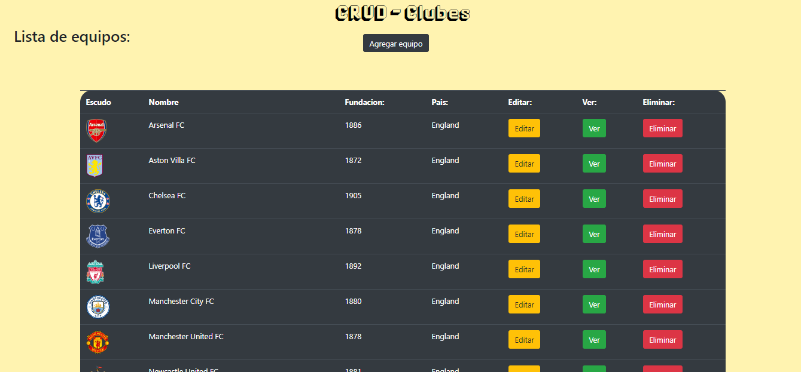
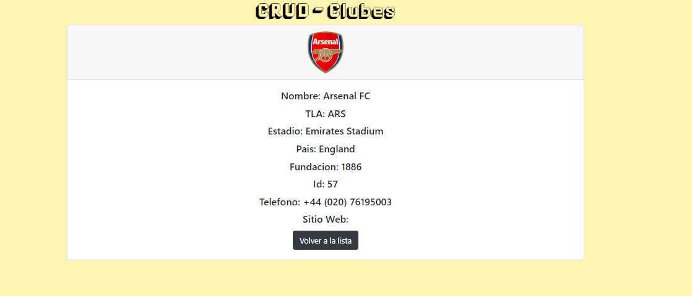
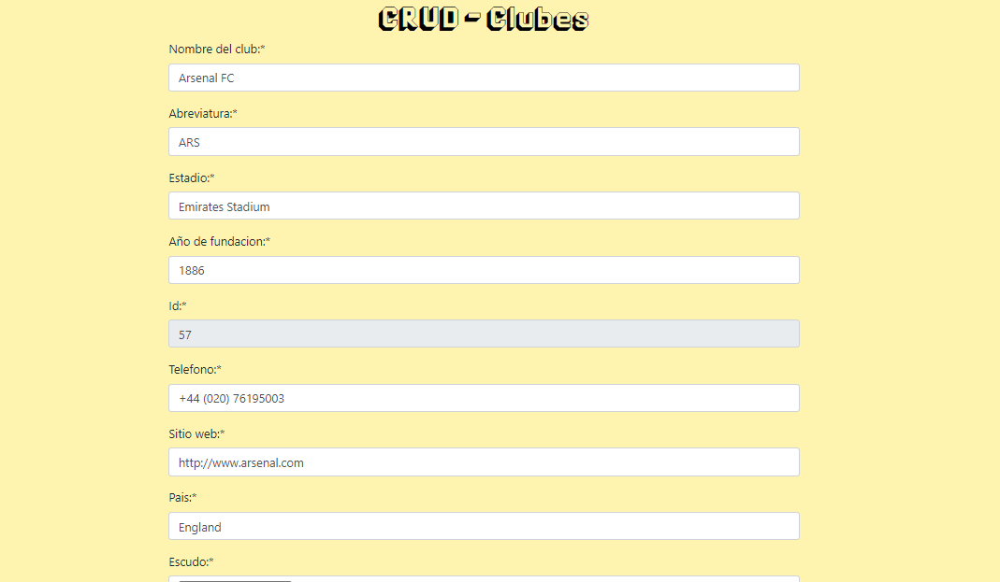
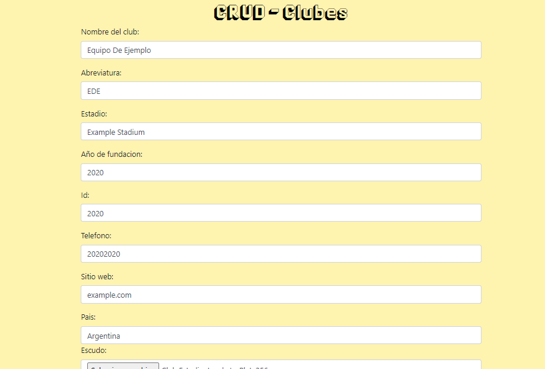

# CRUD Clubes
CRUD¹ Clubes para la tarea de la clase 17 de r/argentina-programa

¹Create, Read, Update and Delete

## Correr el proyecto: 

Correr **npm install** para cargar las dependencias

Correr **npm run dev** para empezar la aplicacion en el puerto 3030

## Lista de cosas a agregar:
- [ ] Agregar google maps para las ubicaciones de los equipos.
- [ ] Agregar Unit Testing.
- [ ] Arreglar el primer equipo de la lista.
- [ ] Separacion en modulos
- [ ] Subirla a Heroku
 
# Imagenes del proyecto: 
### Vista del home: 

### Vista de ver equipo: 

### Vista de editar equipo:

### Vista de agregar equipo: 

